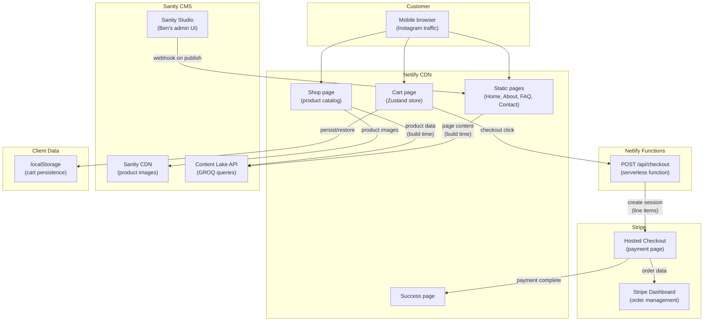

# Architecture Overview

## Summary

SipShield is a standalone e-commerce site for handcrafted oak drink covers, built as a single Next.js 16 application hosted on Netlify's free tier. The site has 7 pages, a client-side cart (Zustand with localStorage persistence), and one serverless API route that creates Stripe Checkout Sessions for multi-item cart checkout. Content and product data are managed in Sanity CMS (free tier), giving Ben (the business owner) an admin interface to manage products, images, and page content without developer involvement.

The architecture optimises for **zero monthly cost** and **solo maintainability**. Every technology choice was evaluated against: "Can one person run this at 2am?" and "Does this cost £0/month?" The total infrastructure cost is ~£5-15/year (domain registration only). Stripe transaction fees (~2.5-3.5% per sale) are the only variable cost.

## System diagram

## Tech stack

| Layer | Technology | Why |
|-------|-----------|-----|
| Framework | Next.js 16 (App Router) | Fixed constraint. SSG for static pages, serverless for checkout API. |
| Language | TypeScript | Type safety, excellent Stripe SDK types. |
| Styling | Tailwind CSS v4 (OKLCH colours) | Best AI code generation, native OKLCH, shadcn/ui ecosystem. |
| State | Zustand (persist middleware) | Simple, tiny (~1KB), localStorage cart persistence. |
| Payments | Stripe Checkout Sessions | Zero monthly cost, hosted PCI-compliant checkout, multi-item cart. |
| CMS | Sanity (free tier) | Image CDN included, intuitive editor for Ben, excellent Next.js SDK. |
| Hosting | Netlify Free | Zero cost, commercial use allowed, good Next.js support. |
| Domain | Cloudflare Registrar | At-cost domain pricing (~£5-8/year). |

## Key decisions

| Decision | ADR | Status | Reversibility |
|----------|-----|--------|---------------|
| TypeScript | [[ADR-001-language-and-runtime]] | decided | one-way-door |
| Next.js 16 App Router | [[ADR-002-framework-selection]] | decided | one-way-door |
| Netlify Free hosting | [[ADR-003-hosting-platform]] | decided | two-way-door |
| Zustand for cart state | [[ADR-004-state-management]] | decided | two-way-door |
| Stripe Checkout Sessions | [[ADR-005-payment-processing]] | decided | two-way-door |
| Tailwind CSS v4 + OKLCH | [[ADR-006-styling-approach]] | decided | two-way-door |
| Sanity CMS | [[ADR-007-content-management]] | decided | two-way-door |

## Domains

See [[Domain Map]] for the full bounded context diagram.

- **Catalog** — Product data, variant groupings, pricing. Managed in Sanity CMS, fetched at build time. Stripe price IDs stored as Sanity fields.
- **Cart** — Client-side Zustand store with localStorage persistence. Display totals only — Stripe calculates authoritative total.
- **Checkout** — Single API route creating Stripe Checkout Sessions. Only server-side code in the application.
- **Content** — Static pages managed in Sanity CMS (Portable Text), fetched at build time. Shared layout and SEO metadata.

## Infrastructure

See [[Infrastructure Overview]] for deployment topology and [[Cost Projection]] for monthly estimates.

**Monthly cost: ~£0** (+ ~£14/mo Stripe fees at £500/mo revenue)
**Annual infrastructure cost: ~£5-15** (domain only)

## Comparisons

- [[Hosting Comparison]] — Vercel vs Netlify vs Cloudflare vs others
- [[CSS Approach Comparison]] — Tailwind vs CSS Modules vs Panda CSS vs Vanilla Extract
- [[CMS Comparison]] — Sanity vs Keystatic vs Contentful vs Storyblok vs others

## Growth path

**With more traffic (1,000-10,000 visitors/month):**
- No architecture changes needed. Netlify free tier handles this comfortably.

**With consistent revenue (>£250/month):**
- Consider Shopify Basic (£32/month) for inventory management, abandoned cart recovery, analytics.
- Migration is straightforward: 13 products recreated in Shopify, DNS pointed to Shopify, done.

**With a team of 5:**
- Add Stripe webhooks for automated order confirmation emails
- Consider Vercel Pro ($20/month) for optimal Next.js DX
- Add monitoring (Sentry for errors, basic uptime monitoring)
- Sanity Studio already supports 20 users — no CMS change needed
- The modular domain structure supports this growth without re-architecture

## One-way doors

These decisions are expensive to reverse and deserve extra scrutiny:

1. **TypeScript** ([[ADR-001-language-and-runtime]]) — Converting away from TypeScript means rewriting every file. However, there's no realistic scenario where this would be desired. Risk: negligible.

2. **Next.js** ([[ADR-002-framework-selection]]) — Migrating away means rewriting the application. For 7 pages and 1 API route, a rewrite would take days — the lock-in cost is low relative to the project size.

## Solo maintainability audit

| Question | Answer |
|----------|--------|
| Can one person run this at 2am? | Yes. Static pages serve from CDN regardless. The only dynamic component is one serverless function. Check Netlify/Stripe/Sanity status pages. |
| Monthly maintenance burden? | Near zero. Dependency updates via Dependabot. No servers to patch, no databases to back up, no certificates to rotate. Sanity is fully managed. |
| Operational surface area? | 3 managed services (Netlify, Stripe, Sanity). No self-managed databases, queues, caches, or background jobs. |
| Two-week vacation? | Nothing requires active attention. Static site keeps serving. Ben can edit content and publish in Sanity — rebuilds are automatic. Orders flow through Stripe. |
