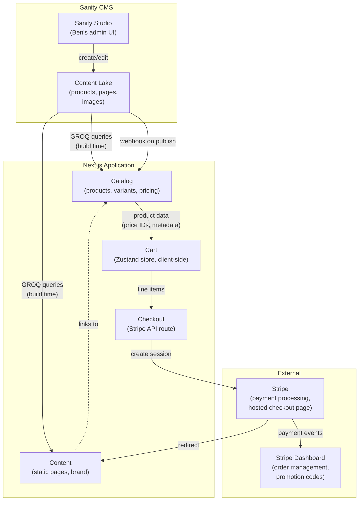

# Domain Map

SipShield is a small e-commerce site with a focused scope. All domains live within a single Next.js application — no service boundaries needed. Domain separation is achieved through folder structure and module boundaries, not deployment units.

## Bounded contexts



## Domain details

### Catalog

**Owns:** Product definitions, variant groupings, pricing, imagery.

**Data source:** Sanity CMS. Products are managed by Ben in Sanity Studio (name, description, images, family, personalisation options). Each product includes a Stripe price ID field that links to the corresponding Stripe product/price. Product data is fetched via GROQ queries at build time (SSG).

**Operations:**
- Display product grid grouped by family
- Show product details with variant selection (Standard/Personalised)
- Provide product data to Cart domain

**CMS workflow:** Ben adds/edits products in Sanity Studio → publishes → Sanity webhook triggers Netlify rebuild → updated product appears on site within ~2-5 minutes.

### Cart

**Owns:** Cart state (items, quantities), cart UI (drawer/page).

**Data source:** Zustand store with `localStorage` persistence. No server-side state.

**Operations:**
- Add/remove/update cart items
- Calculate display totals (authoritative total comes from Stripe at checkout)
- Persist cart across page navigations and browser sessions

**Key decision:** Cart totals shown to the user are display-only. The real total is calculated by Stripe when the Checkout Session is created. This avoids price manipulation attacks.

### Checkout

**Owns:** Stripe integration, session creation, success/cancel handling.

**Data source:** Cart state (line items) → Stripe API → Checkout Session.

**Operations:**
- `POST /api/checkout` — receives cart items, creates Stripe Checkout Session
- Validate that submitted price IDs exist in Stripe
- Redirect customer to Stripe's hosted checkout
- Display success page after payment

**Boundary:** This is the only domain that touches Stripe's server-side API. All Stripe interaction is contained in `lib/stripe.ts` and the API route.

### Content

**Owns:** Static pages (Home, About, FAQ, Contact), shared layout (header, footer, navigation).

**Data source:** Sanity CMS (Portable Text for rich content, SEO metadata fields). Page content fetched via GROQ queries at build time. Shared layout (header, footer, navigation) remains in the codebase.

**Operations:**
- Render static pages from Sanity content (SSG at build time)
- Provide shared layout and navigation (codebase)
- SEO metadata from Sanity fields

## Domain interaction rules

1. **Catalog → Cart:** Cart receives product data (name, price, image, Stripe price ID) when items are added. Cart does not reach back into Catalog.
2. **Cart → Checkout:** Checkout reads cart state to build line items. After successful checkout, Cart is cleared.
3. **Checkout → Stripe:** One-way. The API route creates a session and returns a URL. No webhooks needed for MVP (Ben checks Stripe Dashboard for orders).
4. **Content → Catalog:** Content pages (Home) link to the Shop page. No data dependency.

## What this means for file structure

```
app/
├── page.tsx                 # Content domain (Home)
├── shop/page.tsx            # Catalog domain
├── about/page.tsx           # Content domain
├── faq/page.tsx             # Content domain
├── contact/page.tsx         # Content domain
├── cart/page.tsx            # Cart domain
├── success/page.tsx         # Checkout domain
├── api/checkout/route.ts    # Checkout domain
├── studio/[[...tool]]/      # Sanity Studio (admin UI for Ben)
│   └── page.tsx
└── layout.tsx               # Content domain (shared)

lib/
├── sanity/
│   ├── client.ts            # Sanity client configuration
│   ├── queries.ts           # GROQ queries for products and pages
│   └── image.ts             # Sanity image URL builder
├── stripe.ts                # Checkout domain (Stripe client)
└── cart-store.ts            # Cart domain (Zustand store)

sanity/
├── schema/
│   ├── product.ts           # Product document schema
│   ├── product-family.ts    # Product family schema
│   ├── page.ts              # Page document schema
│   └── site-settings.ts     # Singleton settings schema
└── sanity.config.ts         # Sanity Studio configuration

components/
├── product-card.tsx         # Catalog domain
├── cart-drawer.tsx          # Cart domain
├── portable-text.tsx        # Content domain (renders Sanity rich text)
├── header.tsx               # Content domain
└── footer.tsx               # Content domain
```
