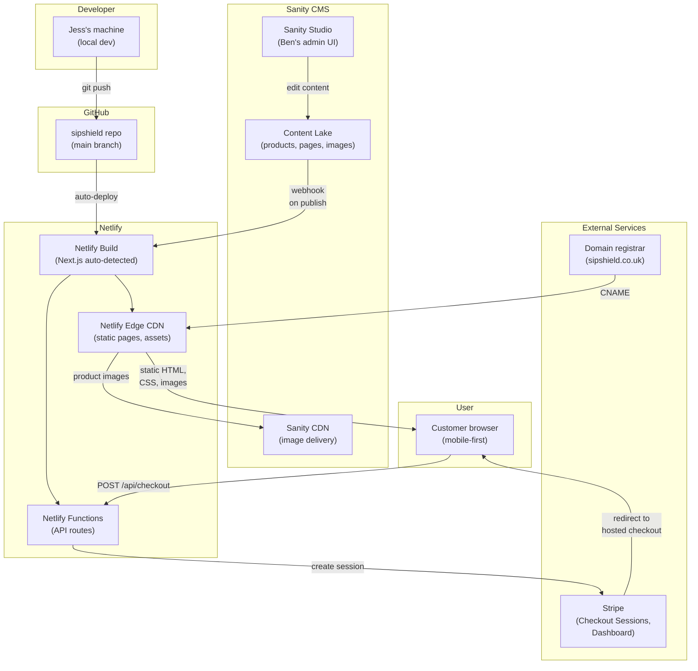

# Infrastructure Overview

## Deployment topology

## Components

### Netlify (hosting)

- **Build:** Triggered on push to `main` branch. Netlify auto-detects Next.js and builds with appropriate adapter.
- **CDN:** Static pages (Home, About, FAQ, Contact, Shop) served from edge nodes. Next.js Image optimisation handled at build time + on-demand.
- **Functions:** API routes deployed as Netlify Functions (serverless). Only one function needed: `POST /api/checkout` for Stripe Checkout Session creation.
- **Preview deploys:** Every PR gets a unique preview URL for testing before merge.

### Stripe (payments)

- **Checkout Sessions:** Server-side session creation via Netlify Function, customer redirected to Stripe's hosted checkout page.
- **Dashboard:** Ben manages orders, refunds, promotion codes, shipping rates, and product prices. No admin panel needed in the application.
- **Products:** Created in Stripe Dashboard. The application references products by Stripe price ID.

### Sanity CMS (content and images)

- **Content Lake:** Stores product data (name, description, price, Stripe price ID, images, family) and page content (Portable Text). Queried via GROQ at build time.
- **Sanity Studio:** Ben's admin interface. Hosted as a route in the Next.js app (`/studio`) or on Sanity's hosted Studio. Ben logs in, edits products/pages, publishes.
- **Image CDN:** Product images uploaded in Studio are served via Sanity's global CDN with automatic transforms (resize, crop, WebP conversion). Integrated with Next.js Image component via `sanity-image`.
- **Webhooks:** On content publish, Sanity sends a webhook to Netlify's build hook, triggering a site rebuild (~2-5 minutes for changes to appear live).

### Domain (sipshield.co.uk)

- Registered via Cloudflare Registrar (at-cost pricing, ~£5-8/year)
- DNS pointed to Netlify via CNAME record
- HTTPS provisioned automatically by Netlify (Let's Encrypt)

## What's NOT in the architecture

These are intentionally excluded to keep operational complexity minimal:

- **No database** — Product data lives in Sanity CMS. Cart is client-side (Zustand + localStorage). Orders live in Stripe.
- **No email service** — Stripe sends payment receipts automatically. No transactional email system needed for MVP.
- **No analytics beyond Netlify** — Netlify provides basic analytics. Google Analytics or Plausible can be added later if needed.
- **No CI/CD beyond Netlify** — No separate GitHub Actions pipeline. Netlify's build is the CI/CD.
- **No monitoring/alerting** — For a site with ~100 visitors/month, Netlify's built-in logs and Stripe Dashboard are sufficient.

## Operational runbook

### Deploying changes
1. Push to `main` branch (or merge PR)
2. Netlify auto-builds and deploys (~2-5 minutes)
3. Verify via the deployment URL

### Adding/changing a product (Ben does this himself)
1. Create product and price in Stripe Dashboard, copy the price ID
2. In Sanity Studio: create new Product, fill in details, paste Stripe price ID, upload images
3. Click "Publish" — Sanity webhook triggers Netlify rebuild, product appears on site in ~2-5 minutes

### Handling an issue at 2am
- **Site down:** Check [Netlify Status](https://www.netlifystatus.com/). If Netlify is up, check deploy logs in Netlify Dashboard.
- **Payments broken:** Check [Stripe Status](https://status.stripe.com/). Review function logs in Netlify Dashboard.
- **Content not updating:** Check Sanity status. Verify webhook is configured in Sanity → Netlify build hooks.
- **Neither:** It can wait until morning. There's no persistent process to crash — static pages keep serving from CDN even if functions or Sanity have issues.

## Security

- **PCI compliance:** Handled entirely by Stripe. No card data touches our servers.
- **HTTPS:** Automatic via Netlify + Let's Encrypt.
- **API route protection:** The checkout API route validates that submitted Stripe price IDs exist before creating a session. Display totals are not trusted — Stripe calculates the authoritative total.
- **Environment variables:** Stripe secret key stored in Netlify environment variables, never committed to Git.
- **No user accounts:** No authentication system, no password storage, no session management.
